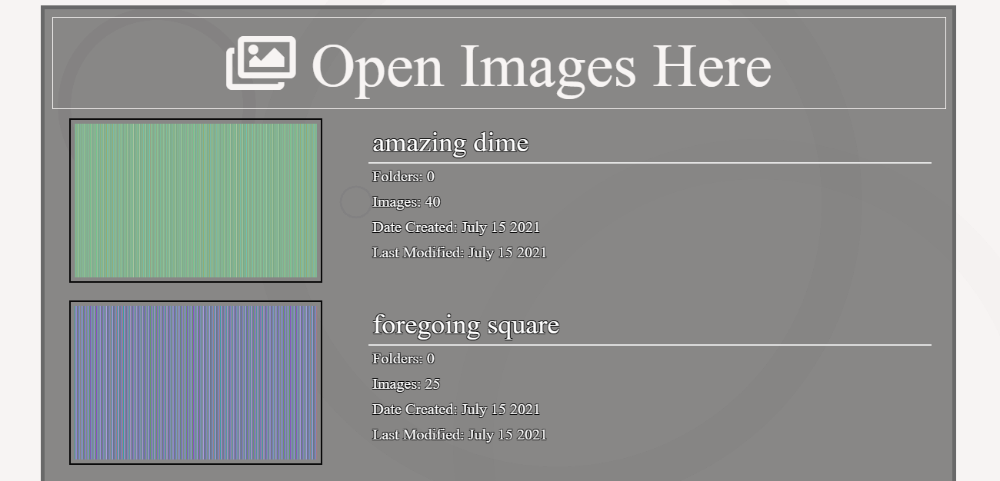
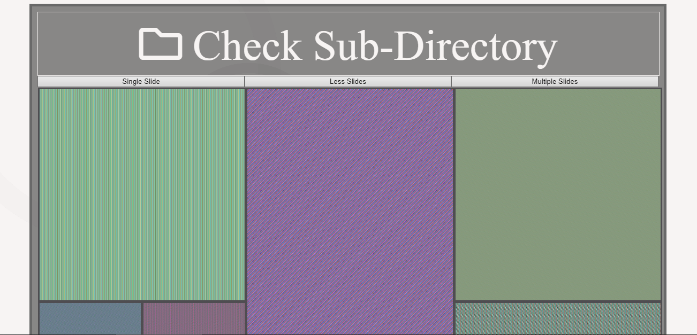
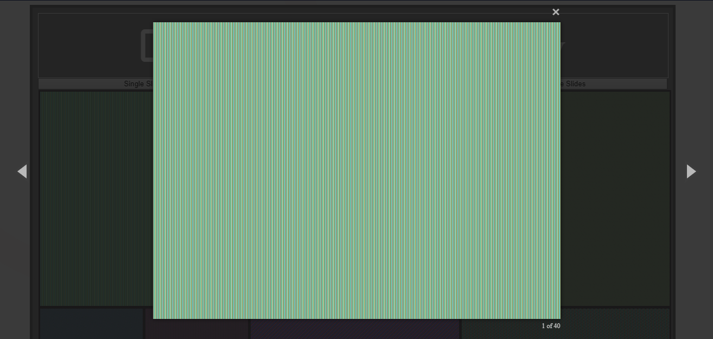
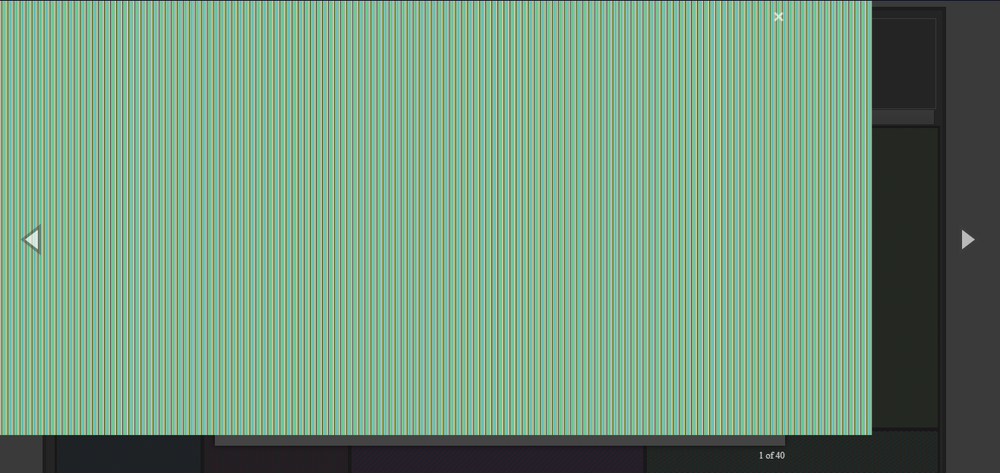

# local-image-browser
A PHP application to host images over a network

The application runs on a server, and it starts with the list.

It displays all the directories in the base location in which you can travel.

When you click on a directory, it will open up the gallery.
It will show all the images residing in that directory.

You can look for images in the sub-directories by clicking on the button on top called "Check Sub-Directory".
Similarly, theres a button on the list called "Check Images" to show images in the current location.

When you click on an image, it will start the magnific-popup api.
It allows you to traverse though the gallery with easy

I have added additional features to the api for better viewing.
You can use the mousewheel to zoom in and out of an image.

When zoomed in, you can move the images in any direction by moving the mouse in the same direction.

